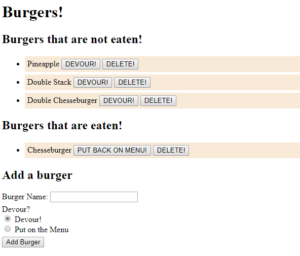

# Burger App

This is a Burger application that demonstrates the usage and connection a MVC (Model View Controller) architecture. This application uses node.js, mysql, and express, as well as other libraries e.g. handlebars. 
The Burger application will add new burgers, as well modify burgers on whether they are eaten or not.  

*  Examples of Burger App:

## Usage

This project was completed using Javascript, Handlebars, MySQL, Node.js and Express and can be ran with node.js

## Contributing
Pull requests are welcome. For major changes, please open an issue first to discuss what you would like to change.

Please make sure to update tests as appropriate.

## License

created by kima111